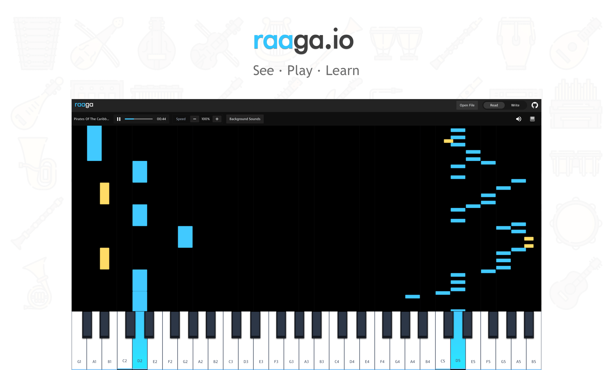

[](#contributors)


[](https://github.com/ritz078/raaga/issues)
[](https://twitter.com/intent/tweet?text=Wow:&url=https%3A%2F%2Fgithub.com%2Fritz078%2Fraaga)

#### Contribution
No specific rule. Just be kind to everyone and hear all the silly ideas. This whole project started from a silly idea. While making this I learnt that sometimes silly ways might work better than traditional methods. This project is like some kind of Research & Development. The first solution generally never works 😂. So in case you are stuck, don't worry. We can do it together. 💪

In case you go through the code and feel like you can make it easier for others to understand by writing inline comments or documentation, feel free to open a PR.

This is a creative project and there is no limit to creativity. If you have got a new idea (big or small), please open an issue. 

Go nuts. 🎉

#### Development

```shell
yarn && yarn dev
```

## Contributors ✨

Thanks goes to these wonderful people ([emoji key](https://allcontributors.org/docs/en/emoji-key)):

<!-- ALL-CONTRIBUTORS-LIST:START - Do not remove or modify this section -->
<!-- prettier-ignore -->
<table>
  <tr>
    <td align="center"><a href="http://www.majidhajian.com"><br /><sub><b>Majid Hajian</b></sub></a><br /><a href="https://github.com/ritz078/raaga/commits?author=mhadaily" title="Code">💻</a></td>
  </tr>
</table>

<!-- ALL-CONTRIBUTORS-LIST:END -->

This project follows the [all-contributors](https://github.com/all-contributors/all-contributors) specification. Contributions of any kind welcome!